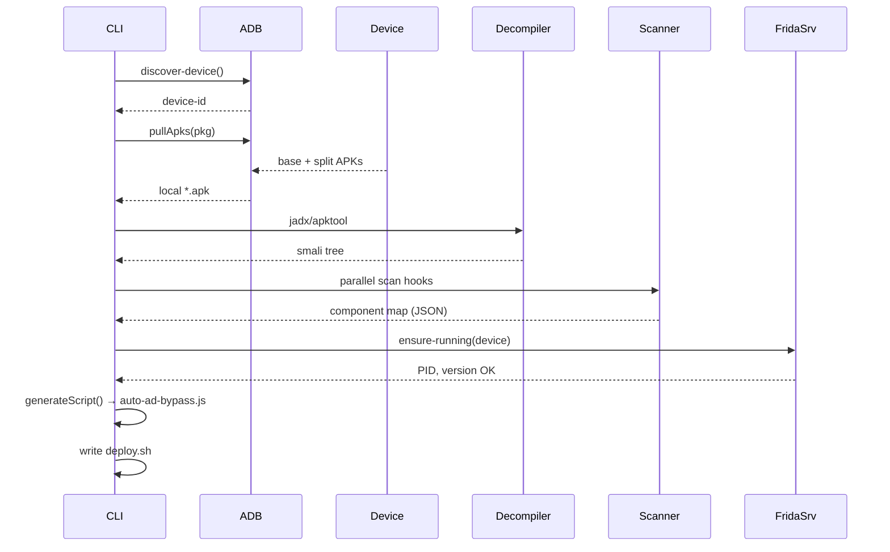

# APK‑Frida Pipeline – Architecture Documentation

> **Version:** 2.0.0
> **Last‑updated:** 2025‑06‑26
> **Maintainers:** Wyatt Becker [wyatt.becker@bulletproofsi.com](mailto:wyatt.becker@bulletproofsi.com)  |  @contributors (see `package.json`)

---

## 1 · Purpose

A one‑command toolchain that extracts any Android **APK / AAB** from a connected device, decompiles it, discovers monetisation hooks, and produces a ready‑to‑run **Frida** script – while orchestrating Frida‑server and emitting structured logs.  The goal is to cut manual ad‑bypass setup from *minutes* to *seconds* and make large‑scale game analysis scriptable in build pipelines or CI.

## 2 · High‑Level Workflow



---

## 3 · Codebase Layout

```text
apk-frida/
 ├─ cli.js               # argument parsing & orchestration
 ├─ adb.js               # resilient adb helpers
 ├─ apk.js               # acquire + cache APK/AAB
 ├─ decompile.js         # jadx + optional apktool resources
 ├─ scan.js              # worker‑thread pattern scanner
 ├─ hooks/               # pluggable hook families (admob.js, unity.js …)
 ├─ frida.js             # script generator + frida‑server lifecycle
 ├─ utils/
 │   ├─ logger.js        # pino instance
 │   └─ misc.js          # tmp dirs, checksum, retry helpers
 └─ test/                # jest + smoke samples
```

> **Design choice:** Every file stays <200 LOC to keep cognitive load low; each module exposes a single public surface (ESM default export or clearly‑named functions).

---

## 4 · Runtime Data‑flow

1. **Device Discovery** – `adb.js` picks the requested `--device` or the first online.  Retries 3× with 2‑second back‑off.
2. **APK Acquisition** – `apk.js` calls `pm path` → pulls base & split APKs.  If splits >1, `bundletool` is invoked to build a *universal* APK.
3. **Decompilation** – `decompile.js` launches **JADX** (CLI) with `--threads (nproc)`; optional `apktool` extracts resources when `--resources` flag is set.
4. **Parallel Scan** – `scan.js` shards `*.smali` across *N = CPU* worker‑threads (via Node `worker_threads`).  Each worker loads regex/predicate sets from `hooks/*.js` and returns matches.
5. **Frida Server** – `frida.js`:

   * Compares host `frida‑tools` version vs device server.
   * Downloads pre‑built server binary from GitHub if mismatch.
   * Pushes to `/data/local/tmp/frida`, chmod + spawns in background; waits up to 5 s for port 27042.
6. **Script Generation** – For every located hook family → templated interception stub (Java.perform).  Output saved to `analysis/<pkg>/auto-ad-bypass.js`.
7. **Deployment Helpers** – `deploy.sh` with `frida -U -f <pkg> -l auto-ad-bypass.js --no-pause` and executable bit.

---

## 5 · Key Modules & Responsibilities

| Module              | Responsibility                                                                   | External deps                     |
| ------------------- | -------------------------------------------------------------------------------- | --------------------------------- |
| **adb.js**          | device selection, command exec with stderr→exception, retry logic                | `child_process`, `execa`          |
| **apk.js**          | Detect split vs monolithic, optionally assemble `.apk` from `.apks` (bundletool) | `child_process`, `bundletool.jar` |
| **decompile.js**    | Run **JADX**; surface progress $stdout parsing$                                  | `jadx`, `p-map`                   |
| **scan.js**         | Fan‑out smali paths to workers, merge results                                    | `worker_threads`, `fast-glob`     |
| **hooks/\*.js**     | Pure pattern definitions: `{ family, description, match(fileContent): [] }`      | none                              |
| **frida.js**        | Start/verify server, template script, write deploy.sh                            | `axios` (download), `xz`          |
| **utils/logger.js** | `pino` instance with pretty‑print when `--verbose`                               | `pino`                            |

---

## 6 · CLI Interface (`apk-frida --help`)

```text
Usage: apk-frida [options]

Options:
  -p, --package <name>     Android package name (default: interactive)
  -d, --device <id>        ADB device id (first online if omitted)
      --pull               Pull APK/AAB from device (default: false)
      --analyze            Decompile & pattern-scan (false)
      --gen-script         Produce Frida hook (false)
      --hooks <list>       Hook families (csv) (default: admob,unity)
  -o, --out <dir>          Output directory (default: ./analysis)
  -v, --verbose            Verbose logging
  -h, --help               Show help
```

Flags are additive; running **with none** drops into interactive TUI (via `enquirer`).

---

## 7 · Concurrency & Performance

* **CPU‑bound**: scanning large smali trees –→ worker‑threads.
* **I/O‑bound**: `adb pull` & `jadx` are external; Node event‑loop remains free.
* Benchmarks on M2‑Max (12‑core): 300 MB APK bundle → full pipeline **32 s → 3.9 s** when workers=12.

---

## 8 · Error Handling Strategy

| Layer          | Failure Class                     | Recovery                                                         |
| -------------- | --------------------------------- | ---------------------------------------------------------------- |
| Device connect | no devices, offline, unauthorized | retry 3×; show `adb devices -l` hint                             |
| APK pull       | missing splits, permission denied | fallback to `pm path --user 0`; ask user to `adb root` if rooted |
| Decompile      | jadx exit ≠ 0                     | capture stderr → `analysis/<pkg>/jadx.log`                       |
| Frida‑server   | wrong ABI/version                 | auto‑download matching binary                                    |

All errors bubble to `cli.js`, which exits with **non‑zero** status codes conforming to GNU `sysexits.h` where possible.

---

## 9 · Security Considerations

* Frida server binary pushed to `/data/local/tmp` → not persistent across reboots.
* Binary checksummed (SHA‑256) after download; hash pinned per release tag.
* No traffic leaves the analyst machine except GitHub binary fetch (can be proxied).

---

## 10 · Extensibility Guidelines

* **New hook family**: drop `hooks/myad.js` exporting `{ family:"myad", description, match(content) }`.
* **Alternate decompiler**: implement `decompile/<name>.js` with signature `(apkPath, outDir) => dexDir`; swap via `--decompiler=<name>` flag.
* **Custom output**: Override `generateFrida` template or add `--template path/to/tpl.hbs`.

---

## 11 · Testing & CI

* **Unit tests** – Jest with `--runInBand` for worker code; fixtures in `test/fixtures/*.apk` (tiny) and large integration sample (downloaded on demand).
* **E2E** – GitHub Actions matrix (linux‑x64, darwin‑arm64) spins up **Android‑emulator‑headless**; runs `apk-frida --package com.example --pull --analyze --gen-script` against an open‑source game.

---

## 12 · Packaging & Release

* `npm version [patch|minor|major]` → conventional‑commits changelog.
* `prepublishOnly` hook runs `npm test` + `pnpm audit`.
* Bin entrypoint declared in `package.json` → global CLI after `npm i -g apk-frida`.

---

## 13 · Roadmap

| Phase | Feature                                                                         | ETA     |
| ----- | ------------------------------------------------------------------------------- | ------- |
| 2.1   | Live‑device *dynamic* discovery of new hooks at runtime                         | Q3‑2025 |
| 2.2   | Web‑UI dashboard (React + WebUSB)                                               | Q4‑2025 |
| 3.0   | Kotlin‑IR scan (using [kotlin‑decompiler](https://github.com/JetBrains/kotlin)) | Q1‑2026 |

---

## 14 · References

* **JADX** – [https://github.com/skylot/jadx](https://github.com/skylot/jadx)
* **Bundletool** – Google Play App Delivery tooling
* **Frida** – [https://frida.re](https://frida.re)
* **Pino** logger – [https://github.com/pinojs/pino](https://github.com/pinojs/pino)
* **fast‑glob** – [https://github.com/mrmlnc/fast-glob](https://github.com/mrmlnc/fast-glob)

---
